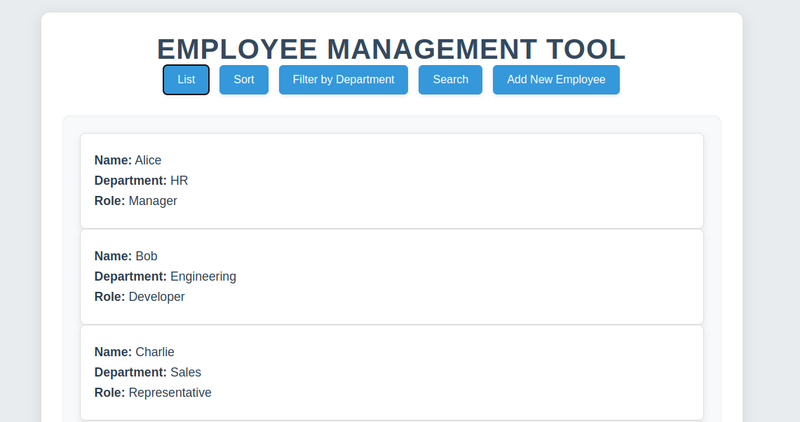
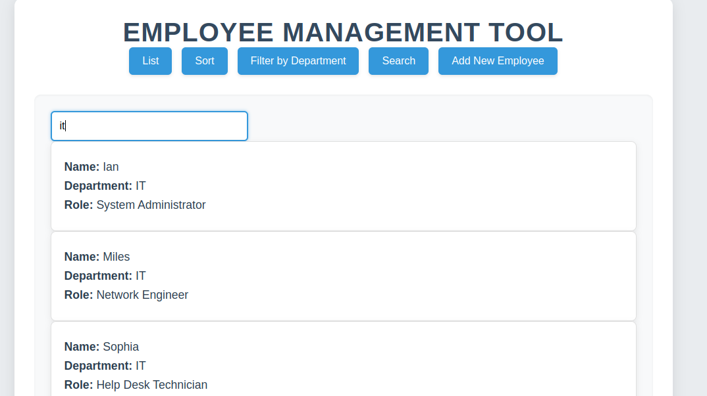
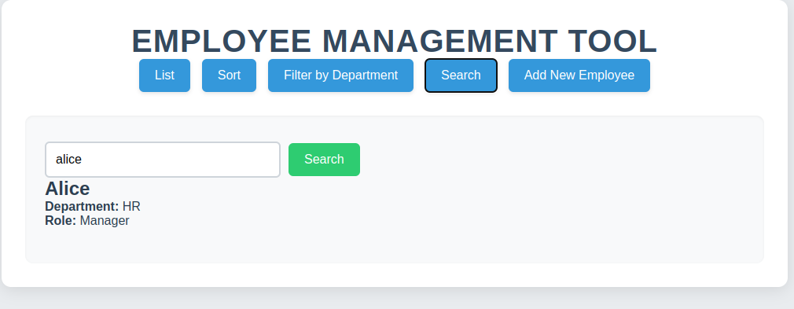
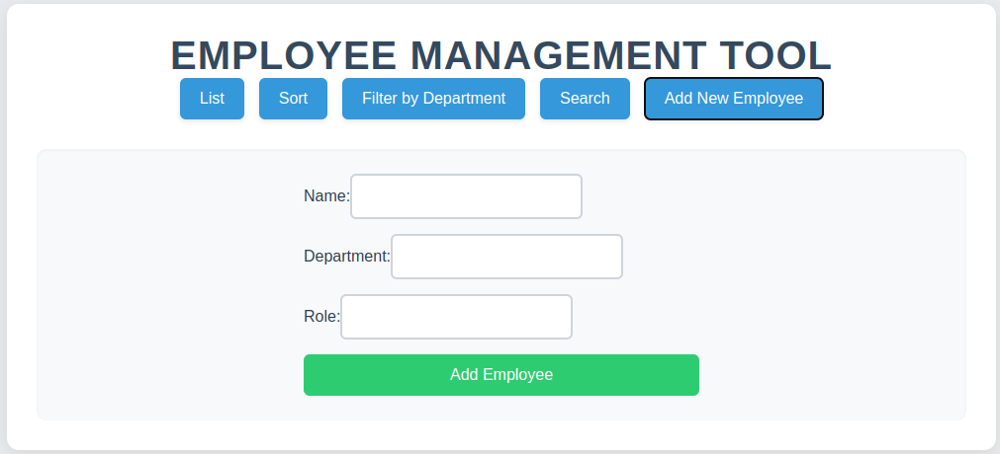

# Employee Management Tool

## Project Overview

The Employee Management Tool is a React-based web application that allows users to manage employee records. It provides functionality to list, sort, search, filter, and add new employees to a database.

## Features

- **List View**: Display all employee records in the original order
- **Sort**: View employees sorted alphabetically by name
- **Search**: Find employees by name with exact match
- **Filter by Department**: Display employees from a specific department
- **Add New Employee**: Form to add a new employee with validation

## Technologies Used

- React.js
- JavaScript (ES6+)
- CSS
- Local Storage for data persistence

## Project Structure

```
employee-management-tool/
│
├── public/
│   ├── employees.json       # Initial employee data
│
├── src/
│   ├── components/
│   │   ├── EmployeeList.jsx     # Component to display list of employees
│   │   ├── EmployeeDetails.jsx  # Component to display employee details
│   │   └── AddEmployeeForm.jsx  # Form to add new employees
│   │
│   ├── App.jsx                  # Main application component
│   ├── index.jsx                # Entry point
│   └── App.css                  # Styling
│   └── index.css│
├── README.md
└── package.json
```

## Setup and Installation

1. Clone the repository:

   ```
   git clone <repository-url>
   ```

2. Navigate to the project directory:

   ```
   cd employee-management-tool
   ```

3. Install dependencies:

   ```
   npm install
   ```

4. Start the development server:

   ```
   npm start
   ```

5. Open [http://localhost:5173/](http://localhost:5173/) in your browser.

## Usage

### List View

- Click the "List" button to view all employees in the original order.

### Sort

- Click the "Sort" button to view employees sorted alphabetically by name.

### Search

- Click the "Search" button to enter search mode.
- Enter an employee name and click "Search".
- The application will display the employee's details if found, or "No match found" otherwise.

### Filter by Department

- Click the "Filter by Department" button.
- Enter a department name to filter employees by that department.

### Add New Employee

- Click the "Add New Employee" button.
- Fill out the form with the employee's details.
- Click "Add Employee" to add the new employee to the list.

## Data Persistence

- The application loads initial employee data from the `employees.json` file.
- When new employees are added, they are stored in the browser's local storage.
- On page refresh, the application will load both the initial data and any added employees.

## Screenshots






### Screenshots to Include:

1. **Main List View**: Screenshot of the main employee list view
2. **Sort View**: Screenshot showing sorted employees
3. **Search View**: Screenshot of the search functionality with results
4. **Filter View**: Screenshot showing filtered employees by department
5. **Add Employee Form**: Screenshot of the form to add a new employee
